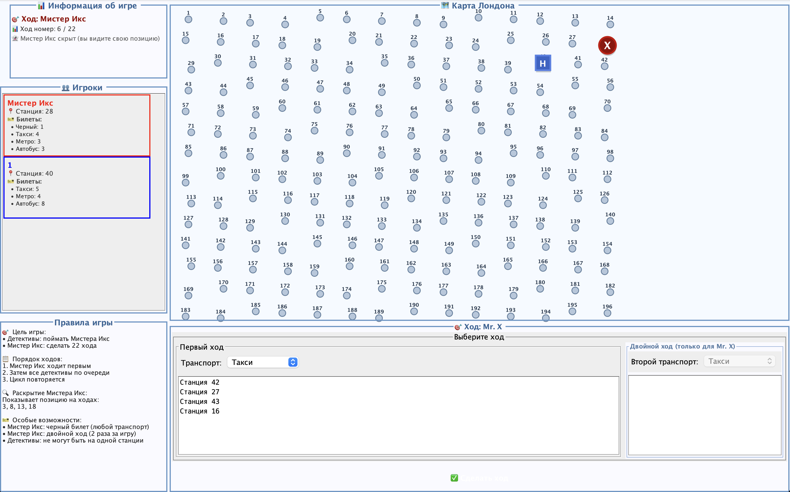

# Scotland Yard

Настольная игра "Scotland Yard" - охота на Мистера Икс в Лондоне.



## Запуск игры

### Требования
- Java 11 или выше
- Maven 3.6+

### Сборка проекта

```bash
# Установить backend модуль в локальный Maven репозиторий
cd backend
mvn clean install

# Вернуться в корень проекта
cd ..
```

### Запуск UI приложения

```bash
cd ui
mvn exec:java -Dexec.mainClass="ru.cs.vsu.oop.task2.lopatin_n.ui.MainWindow"
```

Или после сборки JAR:

```bash
cd ui
mvn clean package
java -jar target/scotland-yard-ui-1.0-SNAPSHOT-jar-with-dependencies.jar
```

## Правила игры

### Цель игры
- **Детективы**: поймать Мистера Икс (оказаться на той же станции)
- **Мистер Икс**: сделать 22 хода, не будучи пойманным

### Порядок ходов
1. Мистер Икс ходит первым
2. Затем все детективы по очереди
3. Цикл повторяется до конца игры

### Раскрытие Мистера Икс
Мистер Икс показывает свое местоположение на ходах: **3, 8, 13, 18**

### Особые возможности
- **Мистер Икс**:
  - Черный билет (можно использовать для любого вида транспорта)
  - Двойной ход (можно использовать 2 раза за игру)
- **Детективы**:
  - Не могут находиться на одной станции друг с другом

### Билеты
- **Такси** (желтый) - короткие расстояния
- **Автобус** (синий) - средние расстояния
- **Метро** (красный) - дальние расстояния
- **Черный билет** (только для Мистера Икс) - любой транспорт

### Условия победы
- **Детективы выигрывают**: если любой детектив оказывается на той же станции, что и Мистер Икс
- **Мистер Икс выигрывает**: если он делает 22 хода, не будучи пойманным
